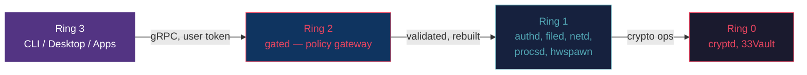
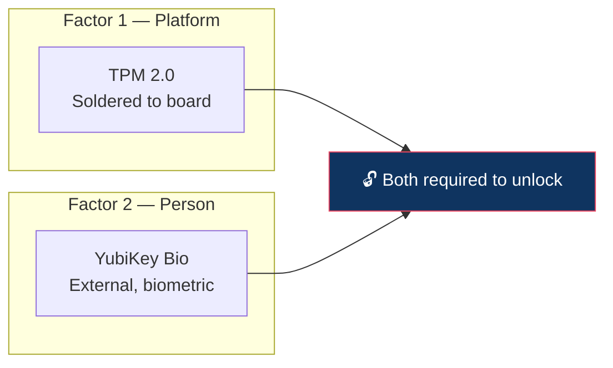
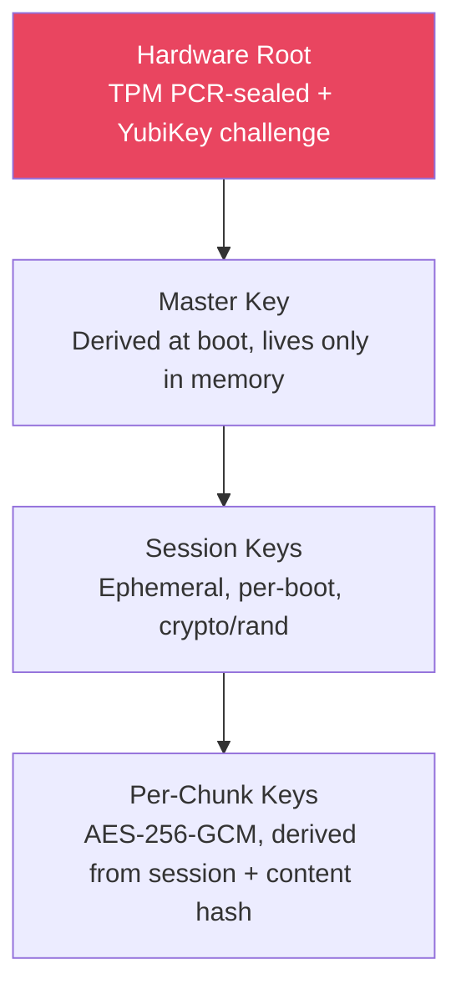
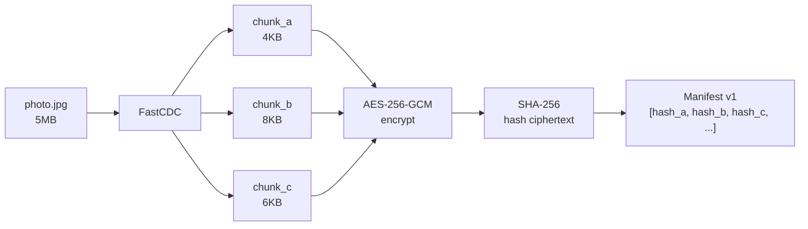

# 33-Linux

**Secure. Immutable. Yours.**

A hardened, immutable Linux distribution designed for people who shouldn't have to think about security. Built on zero-trust principles with hardware-bound encryption, application containerization, and offline-first cloud sync.

## What Is 33-Linux?

33-Linux is a thick-client operating system that runs everything locally while syncing encrypted data to a cloud backend. Think of it as **ChromeOS security meets Apple simplicity** — without handing your data to a corporation.

- **For grandma:** Plug in, tap your YubiKey, use your computer. Can't break it. Can't hack it.
- **For enterprises:** Fleet-managed, policy-driven, containerized applications with full version control.
- **For developers:** The security model you wish your workstation had, with a shell when you need one.

Every app runs in its own container. Every file is chunked, encrypted, and version-controlled. Every action requires hardware authentication. If the device is lost or stolen, it's a paperweight.

## Architecture



**Ring isolation rules:**
- Ring 3 can only call Ring 2 (never Ring 1 or Ring 0 directly)
- Ring 2 validates, rebuilds, and routes — no passthrough
- Ring 1 services cannot call each other — must go through Ring 2
- Ring 1 can call Ring 0 for crypto operations
- Ring 0 only accepts calls from Ring 1

All inter-ring communication is gRPC over Unix sockets with per-ring permission boundaries (`SO_PEERCRED` verification).

## Core Principles

| Principle | What It Means |
|-----------|--------------|
| **Immutable Root** | squashfs mounted read-only, overlayfs+tmpfs for volatile writes. Reboot = factory fresh. |
| **Offline-First** | Everything runs locally. Cloud sync happens when connected; queued changes push automatically. |
| **Hardware-Bound Auth** | TPM proves "right device," YubiKey proves "right person." Both required. |
| **Content-Defined Chunking** | Files split into variable-size chunks (4-16KB), individually encrypted, deduplicated. Only changed chunks sync. |
| **Version-Controlled Everything** | Every file change creates a new version. Roll back any file, any setting, any time. |
| **App Containerization** | Each application runs in its own LXC container with namespace isolation. Browser can't read your email client's data. |
| **Zero-Trust** | Every RPC call authenticated. Modules can't talk to each other directly. Fail-safe deny. |

## Security Model

### Dual-Factor Hardware Authentication



Compromise one → still locked out. Steal the device → useless without the YubiKey. Steal the YubiKey → useless without the device.

### Key Hierarchy



### Threat Model

| Threat | Mitigation |
|--------|-----------|
| Physical theft | TPM + YubiKey dual-factor; encrypted storage; no local plaintext at rest |
| Malware persistence | Immutable root; reboot wipes all volatile state |
| Lateral movement | Per-app LXC containers; ring-isolated services |
| Network MITM | mTLS for all cloud communication; certificate pinning |
| Supply chain | Minimal dependencies (Go stdlib + gRPC/protobuf); signed builds |
| Cloud compromise | Client-side encryption; server only sees encrypted blobs |
| Lost YubiKey | Recovery flow via backup codes or secondary key (configurable) |

## File System: Content-Defined Chunking

Files aren't stored as files. They're split into variable-size chunks using a rolling hash (FastCDC), individually encrypted, and referenced by content hash.



**Benefits:**
- **Delta sync:** Edit the middle of a file → only changed chunks re-encrypt and sync
- **Deduplication:** Identical content = identical chunks = stored once
- **Version control:** Each version is a manifest pointing to chunks. Rollback = load old manifest. Storage cost ≈ 1.1x, not Nx.
- **No metadata leakage:** Encrypt first, then hash ciphertext. Server can't determine file contents or detect identical files across users.

## Cloud Backend

The cloud server is the sync target, not the compute platform:

- **Config store** — source of truth for device policies and settings
- **Encrypted backup** — receives encrypted chunks, can't decrypt them
- **Version history** — stores manifests for rollback capability
- **App/OS updates** — distributes signed squashfs images
- **Fleet management** — manages multiple devices per user/family/org
- **User recovery** — new device pulls everything from cloud backup

### Deployment Options

| Option | Description |
|--------|------------|
| **Self-hosted** | Run the server on your own hardware (homelab, VPS). Free forever. |
| **Subscription** | We host it. Pay monthly for storage, sync, and support. |

The server is open source under [BUSL-1.1](#license). Run it yourself, or let us run it for you.

## Target Hardware

### Primary: ARM Single-Board Computers
- Raspberry Pi 5 (8GB) — development target (no TPM, YubiKey-only auth)
- Radxa Rock 5B — TPM header available
- Any SBC with USB for external TPM module

### Future: x86_64
- Standard desktops/laptops with TPM 2.0
- Enterprise thin clients

### Hardware Requirements
- **Minimum:** 4GB RAM, USB port (for YubiKey), SD card or USB SSD
- **Recommended:** 8GB RAM, TPM 2.0 (on-board or USB module), NVMe/SSD
- **Network:** Ethernet or WiFi (for cloud sync; not required for local operation)

## Project Status

### Phase 1: Core Boot & Local System ← **Current**
- [x] Go-based init system (PID 1)
- [x] Immutable root (squashfs + overlayfs + tmpfs)
- [x] gRPC dispatcher with Unix socket
- [x] Core modules: authd, cryptd, filed, netd (stub), procsd, hwspawn
- [x] CLI client (`33` command)
- [x] Encrypted file queue for sync
- [x] Dev mode for local development
- [ ] Ring 2 gateway (`gated`)
- [ ] Wayland compositor (kiosk mode)
- [ ] Browser in LXC container
- [ ] YubiKey integration
- [ ] TPM enrollment

### Phase 2: Cloud Integration & Sync
- [ ] Cloud backend server (auth, sync, blob store)
- [ ] Content-defined chunking engine
- [ ] Offline queue drain with conflict resolution
- [ ] Provisioning tool (`33-prov`)
- [ ] Signed OS updates (A/B partition)
- [ ] Subscription/licensing enforcement

### Phase 3: Desktop & Ecosystem
- [ ] Full Wayland desktop environment
- [ ] App containerization (LXC per app)
- [ ] App catalog with signed packages
- [ ] 33Vault password manager
- [ ] Multi-device sync & roaming
- [ ] Enterprise fleet management

### Phase 4: Hardening & Scale
- [ ] Formal security audit
- [ ] Post-quantum cryptography migration
- [ ] Mobile variant
- [ ] Pre-built hardware kits

## Building

### Prerequisites
- Go 1.25+
- `protoc` with Go plugins (`protoc-gen-go`, `protoc-gen-go-grpc`)
- Make

### Build

```bash
# Generate protobuf code and build binaries
make build

# Run in dev mode (no real mounts, local socket)
DEV_MODE=1 ./bin/initd

# In another terminal, use the CLI
DEV_MODE=1 ./bin/33 version
DEV_MODE=1 ./bin/33 auth login -u admin -p admin
DEV_MODE=1 ./bin/33 hw detect
```

### Cross-compile for ARM64 (Raspberry Pi)

```bash
GOOS=linux GOARCH=arm64 go build -trimpath -ldflags="-s -w" -o bin/initd-arm64 ./cmd/initd
GOOS=linux GOARCH=arm64 go build -trimpath -ldflags="-s -w" -o bin/33-arm64 ./cmd/climain
```

## Repository Structure

```
33-linux/
├── cmd/
│   ├── initd/          # Init system (PID 1)
│   └── climain/        # CLI client (the `33` command)
├── internal/
│   ├── authd/          # Authentication & session management
│   ├── cryptd/         # AES-256-GCM encryption
│   ├── dispatcher/     # gRPC server & Unix socket management
│   ├── filed/          # File proxy, cache, sync queue
│   ├── hwspawn/        # Hardware detection & container spawning
│   ├── mount/          # Immutable root filesystem setup
│   ├── netd/           # Network & cloud sync (Phase 1: stub)
│   └── procsd/         # Process & LXC container spawner
├── proto/
│   ├── auth/v1/        # Auth service protobuf definitions
│   ├── crypto/v1/      # Crypto service protobuf definitions
│   ├── file/v1/        # File service protobuf definitions
│   ├── hw/v1/          # Hardware spawner protobuf definitions
│   ├── net/v1/         # Network service protobuf definitions
│   └── proc/v1/        # Process service protobuf definitions
├── docs/               # Architecture & design documentation
├── Makefile
├── go.mod
└── LICENSE
```

## Inspiration

- [Talos Linux](https://github.com/siderolabs/talos) — immutable, API-driven, Kubernetes-focused. We're device-focused.
- [Qubes OS](https://www.qubes-os.org/) — compartmentalization pioneer. We make it accessible.
- [ChromeOS](https://www.chromium.org/chromium-os/) — security for everyone. We remove the Google dependency.
- [Restic](https://github.com/restic/restic) — content-defined chunking and deduplication for backups.
- [Syncthing](https://github.com/syncthing/syncthing) — offline-first sync protocol design.

## License

[Business Source License 1.1 (BUSL-1.1)](LICENSE)

**You can:** Self-host, modify, contribute, run for personal or internal use.
**You cannot:** Sell hosted services based on this code without a commercial license.

Self-hosters are first-class citizens. The subscription service funds development.

---

<p align="center">
  <strong>33-Linux</strong> — Because your grandmother deserves better security than most corporations have.
</p>
