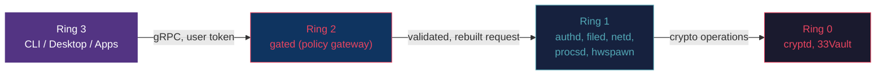
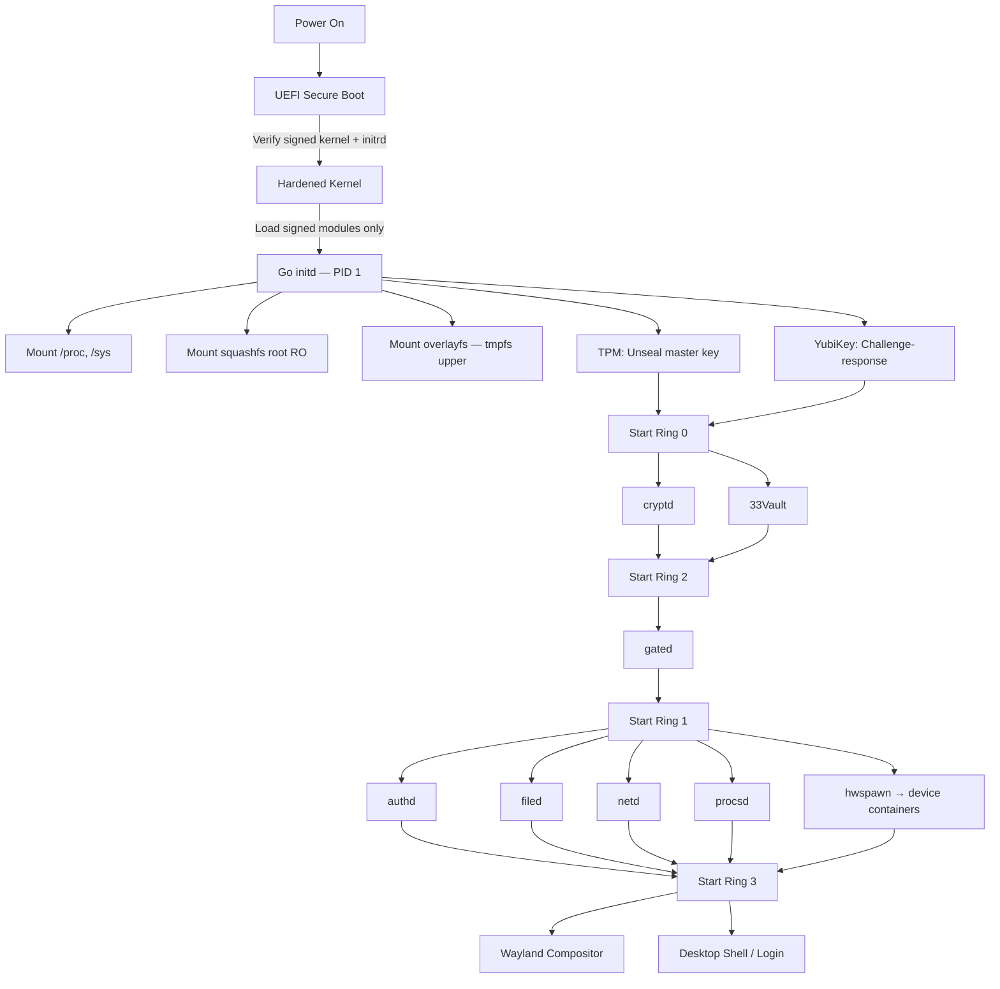
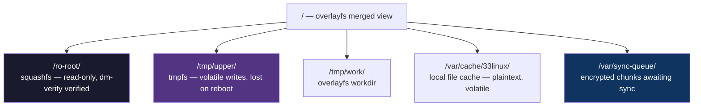
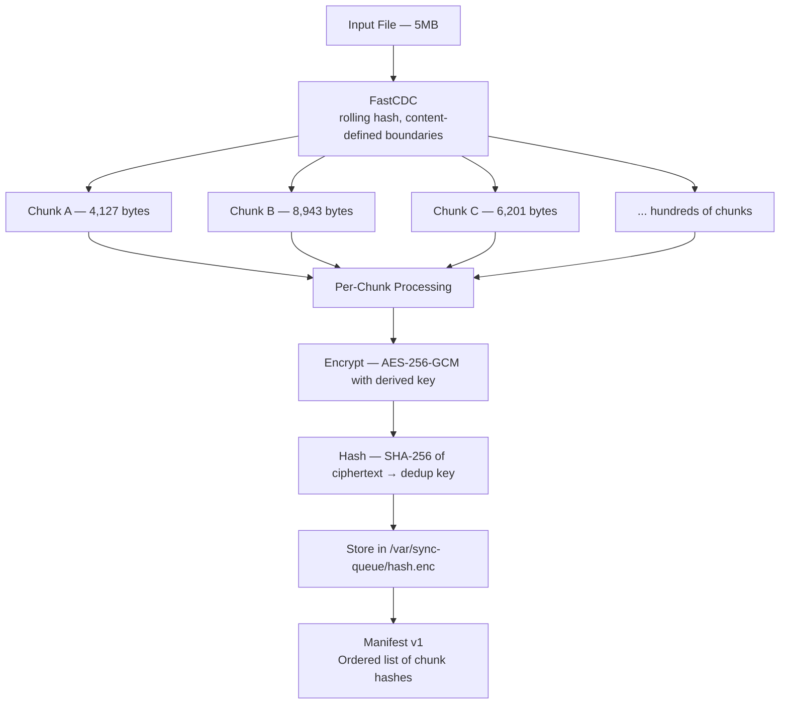
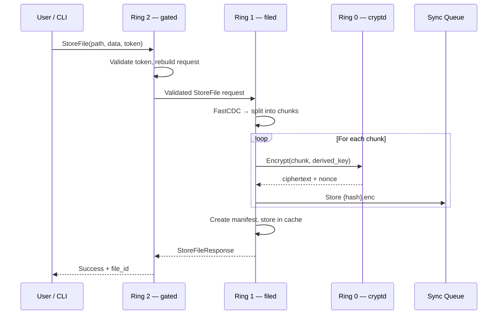
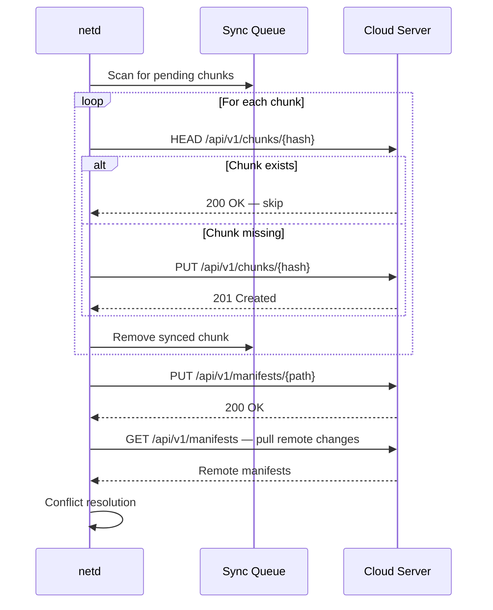
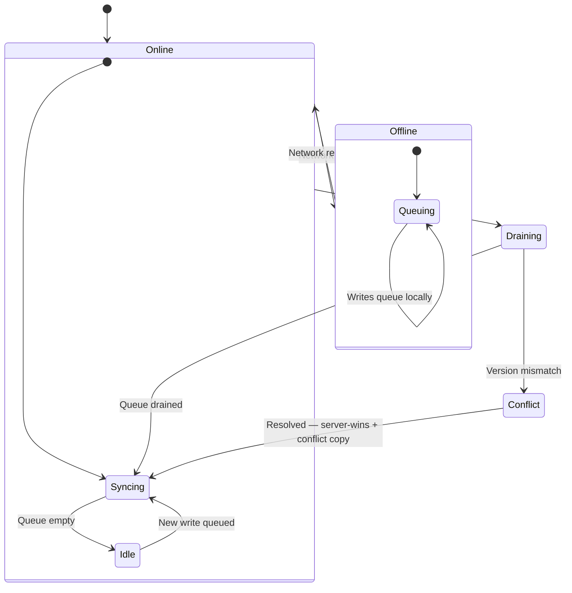
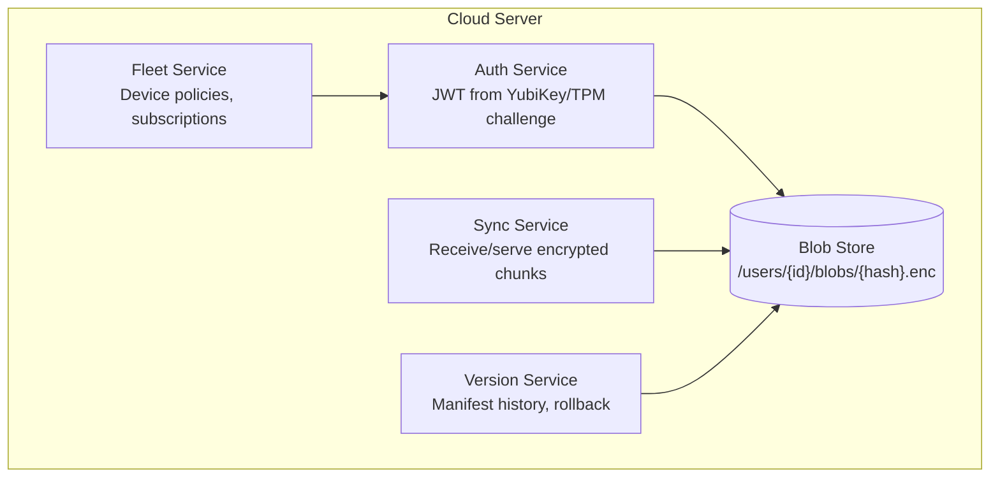

# Architecture

## Overview

33-Linux is a hardened, immutable operating system built around a ring-based security architecture. All userspace services are written in Go and communicate exclusively via gRPC over Unix sockets. The system is designed as a thick client — everything runs locally, with an optional cloud backend for encrypted sync, backup, and fleet management.

## Design Philosophy

1. **Defense in depth through isolation.** Every service, every app, every device runs in its own compartment. Compromising one gives you nothing.
2. **Hardware is the root of trust.** No software-only secrets. The TPM and YubiKey together form the authentication foundation.
3. **Offline-first.** The system must work without network access. Cloud sync is a convenience, not a dependency.
4. **Immutability as default.** The root filesystem is read-only. Volatile state lives in tmpfs. Persistence requires explicit, encrypted sync.
5. **Simplicity for the user, complexity hidden in the architecture.** Grandma sees a desktop. Engineers see four privilege rings, per-app containers, and hardware-bound encryption.

## Ring Architecture

Inspired by CPU privilege rings, the service architecture enforces strict call hierarchies:



### Ring 0: Hardware Security

**Services:** `cryptd`, `33Vault`

The innermost ring handles all cryptographic operations and secrets management. These services hold the master keys (derived from TPM + YubiKey) and perform encryption/decryption on behalf of Ring 1 callers.

**Constraints:**
- Only accepts calls from Ring 1 services
- Unix socket with `0600` permissions, owned by Ring 0 service user
- Caller identity verified via `SO_PEERCRED`
- No network access, no filesystem access beyond its own socket
- Keys exist only in memory; never written to disk

**Why separate:** If any other service is compromised, the attacker cannot extract encryption keys. They can request operations (if they've compromised a Ring 1 service), but they can't exfiltrate the keys themselves.

### Ring 1: Core Services

**Services:** `authd`, `filed`, `netd`, `procsd`, `hwspawn`

Core system services that implement business logic. Each service is isolated — they **cannot call each other directly**. All inter-service communication routes through Ring 2.

| Service | Responsibility |
|---------|---------------|
| `authd` | Session management, user authentication, key derivation |
| `filed` | File storage, caching, chunk management, sync queue |
| `netd` | Network management, cloud sync protocol, offline queue drain |
| `procsd` | Process spawning, LXC container lifecycle management |
| `hwspawn` | Hardware detection, device authentication, device container spawning |

**Constraints:**
- Can call down to Ring 0 for crypto operations
- Cannot call other Ring 1 services (must go through Ring 2)
- Accept calls only from Ring 2 (`gated`)
- Each service runs in its own namespace with minimal capabilities

**Why isolated:** If `netd` is compromised via a network attack, it cannot access `filed`'s cache or `authd`'s session store. The attacker is contained to one service.

### Ring 2: Policy Gateway (`gated`)

**Service:** `gated`

The central policy enforcement point. Every request between rings passes through `gated`, which:

1. **Validates** the caller's identity and authorization
2. **Deserializes** the incoming request completely
3. **Validates** the request against security policies
4. **Rebuilds** a new request from scratch (no passthrough of raw bytes)
5. **Routes** the rebuilt request to the correct Ring 1 service
6. **Logs** the transaction for audit

**Constraints:**
- Accepts calls from Ring 3 (user-facing layer)
- Routes calls to Ring 1 services
- Does NOT call Ring 0 directly
- Is the most hardened, most minimal service in the stack
- Zero external dependencies beyond gRPC

**Why rebuild instead of proxy:** If a malformed or malicious request comes in, passthrough would propagate the attack. By deserializing, validating, and constructing a fresh request, `gated` acts as an application-layer firewall.

**Critical:** `gated` is the highest-value target. Compromise `gated`, compromise everything. It must be:
- Minimal code (smallest possible attack surface)
- No dynamic configuration (policy is compiled in or loaded from signed config)
- Heavily fuzz-tested
- The first component to receive a security audit

### Ring 3: User Interface

**Components:** CLI (`33`), Wayland compositor, desktop shell

The user-facing layer. Can only communicate with Ring 2. Never has direct access to Ring 1 services or Ring 0 crypto.

## Boot Sequence



### Dev Mode

When `DEV_MODE=1`, the init system:
- Skips real filesystem mounts (uses local directories)
- Uses `/tmp/33linux-rpc.sock` instead of `/run/33linux/rpc.sock`
- Bootstraps with a default admin user
- Runs all modules in the same process (no ring isolation)

## Filesystem Architecture

### Immutable Root



Any write to the filesystem goes to the tmpfs upper layer. On reboot, it's gone. Persistent data must be explicitly stored through `filed`, which encrypts and queues it for cloud sync.

### Content-Defined Chunking

Files stored through `filed` are split using FastCDC (content-defined chunking) with a target range of 4-16KB:



**Why content-defined (not fixed-size):** Inserting a byte at the start of a file with fixed-size chunks would change every chunk boundary, destroying deduplication. CDC boundaries are determined by content, so insertions only affect nearby chunks.

**Encryption order:** Encrypt → then hash ciphertext. This prevents metadata leakage (server can't tell if two users have the same file) at the cost of no cross-user deduplication. Security > storage savings.

## Data Flow

### File Store



### Cloud Sync



### Offline Behavior



## Cloud Backend Architecture

The server is a Go monolith with clear separation:



**The server never sees plaintext.** All encryption/decryption happens client-side. The server stores opaque encrypted blobs and manifests. Even a full server compromise yields nothing useful.

**Transport:** TLS 1.3 with mutual authentication (client cert from TPM/YubiKey). Certificate pinning prevents MITM even if a CA is compromised.

## Module Reference

### authd (Ring 1)

Manages user sessions and key derivation.

| RPC | Description |
|-----|------------|
| `Login(username, password)` | Authenticate user, return session token |
| `DeriveKey(session_token, context)` | Derive a context-specific key from session master key |

Phase 1: In-memory user store with SHA-256 password hashing (salted with username).
Phase 2: YubiKey/TPM challenge-response, cloud-backed user directory.

### cryptd (Ring 0)

Pure encryption/decryption using AES-256-GCM.

| RPC | Description |
|-----|------------|
| `Encrypt(plaintext, key)` | Encrypt data, return ciphertext + nonce |
| `Decrypt(ciphertext, key, nonce)` | Decrypt data, return plaintext |

Also exposes `EncryptBytes`/`DecryptBytes` as Go library functions for direct in-process use (filed uses these for queue encryption).

### filed (Ring 1)

File proxy with local cache and sync queue.

| RPC | Description |
|-----|------------|
| `StoreFile(path, data, token)` | Store file in cache, encrypt and queue for sync |
| `LoadFile(path, token)` | Load file from local cache |

Phase 2 additions: `ChunkFile`, `ListVersions`, `Rollback`, `ResolveConflict`.

### netd (Ring 1)

Network management and cloud sync.

| RPC | Description |
|-----|------------|
| `SyncQueue(token)` | Trigger queue drain to cloud |
| `APIGet(endpoint, token)` | Make authenticated API call to cloud |

Phase 1: Stub (logs requests, no actual sync).

### procsd (Ring 1)

Process and container lifecycle.

| RPC | Description |
|-----|------------|
| `SpawnProc(binary, args, token)` | Start a process |
| `SpawnLXC(name, image, token)` | Create and start an LXC container |

### hwspawn (Ring 1)

Hardware detection and device containerization.

| RPC | Description |
|-----|------------|
| `DetectDevices(token)` | Scan /sys/class for connected hardware |
| `AuthDevice(device_id, token)` | Check device against allowlist, spawn container |

Phase 1: Allow-all when no policy configured (dev mode).
Phase 2: Cloud-backed device policy with deny-by-default.

## Concurrency Model

- All services run as goroutines within the init process (Phase 1)
- Phase 2+: Each service in its own process with dedicated namespaces
- gRPC handles concurrent requests via its built-in goroutine pool
- Shared state protected by `sync.RWMutex` (sessions, process table)
- Channels preferred over mutexes for new designs
- Context propagation for cancellation and timeouts

## Build System

```bash
make proto    # Generate .pb.go from .proto files
make build    # Build initd and CLI binaries
make test     # Run all tests
make clean    # Remove build artifacts
```

### Cross-Compilation

```bash
# Raspberry Pi / ARM64
GOOS=linux GOARCH=arm64 go build -trimpath -ldflags="-s -w" -o bin/initd-arm64 ./cmd/initd

# x86_64 (default)
GOOS=linux GOARCH=amd64 go build -trimpath -ldflags="-s -w" -o bin/initd ./cmd/initd
```

All binaries built with `-trimpath` (reproducible) and `-ldflags="-s -w"` (stripped, no debug symbols).
