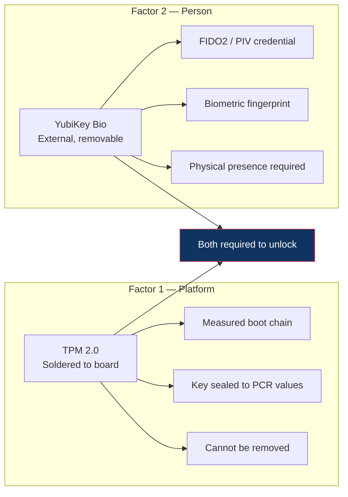
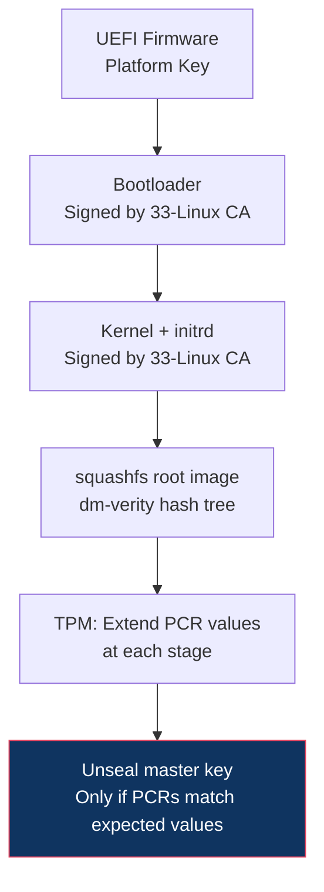
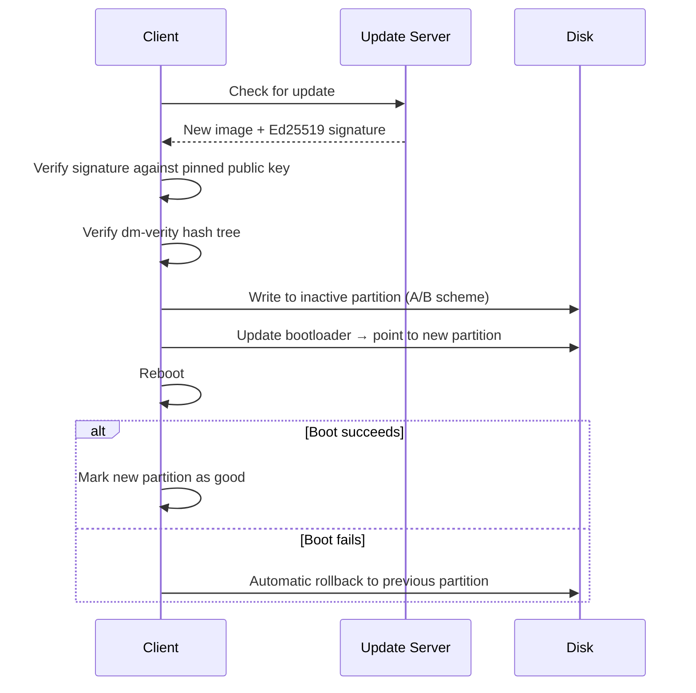
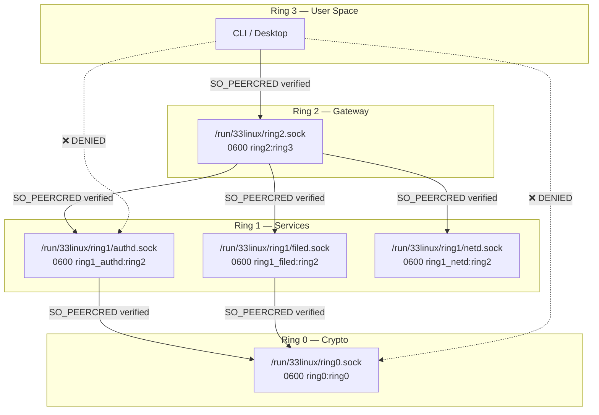
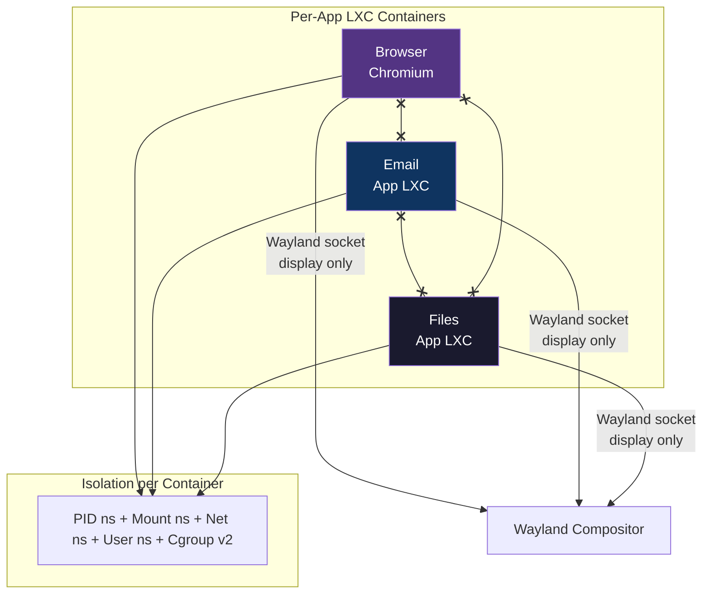
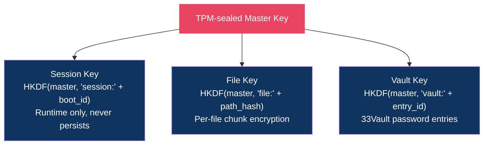

# Security Model

## Overview

33-Linux implements a zero-trust security architecture where every component is assumed hostile until proven otherwise. Security is enforced at multiple layers: hardware, boot chain, filesystem, service isolation, and network transport.

## Principles

1. **Deny by default.** No access is granted without explicit authentication and authorization.
2. **Hardware roots of trust.** Software-only secrets are insufficient. TPM and YubiKey provide hardware-bound authentication.
3. **Compartmentalize everything.** Services can't talk to each other. Apps can't read each other's data. Devices are isolated in containers.
4. **Immutability prevents persistence.** Malware can't survive a reboot because the root filesystem is read-only and volatile state is tmpfs.
5. **Client-side encryption.** The cloud server is untrusted. All data is encrypted before leaving the device.
6. **Minimal dependencies.** Every dependency is an attack surface. Go stdlib + gRPC/protobuf only.

## Hardware Authentication

### Dual-Factor Model

Two independent hardware factors are required for system access:



#### Why Both?

| Scenario | TPM Alone | YubiKey Alone | Both Required |
|----------|-----------|---------------|--------------|
| Device stolen | ❌ Attacker has keys | ✅ Blocked | ✅ Blocked |
| YubiKey stolen | ✅ Works | ❌ Attacker has access | ✅ Blocked |
| Remote exploit | ✅ Can extract sealed keys | ✅ No physical presence | ✅ Blocked |
| Evil maid (boot tamper) | ❌ PCR bypass possible | N/A | ✅ PCR + presence required |

### Recovery

Lost YubiKey recovery options (configurable per deployment):

1. **Backup YubiKey:** Register a second key during enrollment. Keep it in a safe.
2. **Recovery codes:** 8 single-use alphanumeric codes printed at enrollment.
3. **Cloud-assisted recovery:** Identity verification through the subscription service (enterprise only).
4. **Emergency break-glass:** Physical access to the server + admin credentials (self-hosted only).

If both device AND YubiKey are lost: recover from cloud backup to a new device with a backup YubiKey or recovery codes.

## Boot Security

### Secure Boot Chain



### Kernel Hardening

Compile-time security options:

| Option | Purpose |
|--------|---------|
| `CONFIG_SECURITY_YAMA=y` | ptrace restrictions |
| `CONFIG_MODULE_SIG=y` | Only signed kernel modules |
| `CONFIG_MODULE_SIG_FORCE=y` | Reject unsigned modules |
| `CONFIG_STACKPROTECTOR_STRONG=y` | Stack buffer overflow protection |
| `CONFIG_FORTIFY_SOURCE=y` | Compile-time buffer overflow detection |
| `CONFIG_STRICT_DEVMEM=y` | Restrict /dev/mem access |
| `CONFIG_IO_STRICT_DEVMEM=y` | Restrict I/O memory access |
| `CONFIG_LOCK_DOWN_KERNEL_FORCE_CONFIDENTIALITY=y` | Kernel lockdown |
| `CONFIG_INIT_ON_ALLOC_DEFAULT_ON=y` | Zero memory on allocation |
| `CONFIG_INIT_ON_FREE_DEFAULT_ON=y` | Zero memory on free |

Runtime parameters (kernel command line):

```
lockdown=confidentiality init_on_alloc=1 init_on_free=1
page_alloc.shuffle=1 slab_nomerge vsyscall=none
```

### Update Verification

OS updates are distributed as signed squashfs images:



## Service Isolation

### Ring Enforcement

Each ring runs with progressively fewer capabilities:

| Ring | User | Capabilities | Namespaces | Network |
|------|------|-------------|------------|---------|
| Ring 0 | `ring0` | `CAP_SYS_ADMIN` (crypto only) | All isolated | None |
| Ring 1 | `ring1_{service}` | Minimal per-service | PID, Mount, Net | Per-service |
| Ring 2 | `ring2` | None (pure routing) | PID, Mount | Loopback only |
| Ring 3 | `user` | None | Full isolation | Filtered |

### Unix Socket Permissions



`SO_PEERCRED` is checked on every connection to verify the calling process's UID/GID matches the expected ring.

### Application Containers



**Isolation guarantees:**
- App A cannot see App B's processes (PID namespace)
- App A cannot read App B's files (mount namespace)
- App A cannot sniff App B's network (network namespace)
- App A has resource limits (cgroup v2 — CPU, memory, I/O)
- Apps communicate with the system only through gRPC to Ring 3 → Ring 2

## Encryption

### At Rest

All persistent data is encrypted using AES-256-GCM:

- **Chunk-level encryption:** Each file chunk is independently encrypted with a derived key
- **Key derivation:** `HKDF-SHA256(master_key, chunk_content_hash)` → per-chunk key
- **Nonce:** Random 12 bytes from `crypto/rand` per encryption operation
- **AAD (Additional Authenticated Data):** Includes chunk index and manifest version to prevent reordering attacks

### In Transit

- **Client ↔ Server:** TLS 1.3 with mutual authentication (client cert from YubiKey PIV)
- **Certificate pinning:** Client embeds server public key hash; rejects any other cert
- **No plaintext ever leaves the device.** The server receives and serves encrypted blobs.

### Key Management



**Phase 1 limitation:** Master key is generated randomly per session (no TPM integration yet). This means data encrypted in one session can't be decrypted in the next. Phase 2 adds TPM-sealed persistent keys.

## Threat Model

### In Scope

| Threat | Attack Vector | Mitigation |
|--------|--------------|-----------|
| Physical device theft | Boot from USB, read disk | TPM-sealed keys + YubiKey required; encrypted storage |
| Evil maid | Modify bootloader/kernel | Secure Boot; PCR measurements detect tampering |
| Malware/ransomware | Exploit in browser/app | App containerization; immutable root; reboot recovers |
| Lateral movement | Compromised app → other apps | Per-app LXC; ring isolation; no inter-service comms |
| Network eavesdropping | MITM on cloud sync | mTLS + cert pinning; all data pre-encrypted |
| Cloud server breach | Attacker accesses server DB | Client-side encryption; server stores opaque blobs |
| Credential phishing | Social engineering for passwords | No passwords — YubiKey biometric only |
| Supply chain | Malicious dependency | Minimal deps (stdlib + gRPC); signed builds |
| Privilege escalation | Kernel exploit from userspace | Hardened kernel; YAMA; signed modules only |

### Out of Scope (Phase 1)

- Side-channel attacks (timing, power analysis) — future hardening
- Post-quantum cryptography — planned for Phase 4
- Advanced persistent threats with physical lab access
- Compromised hardware supply chain (e.g., implanted TPM)

## Comparison

| Feature | 33-Linux | ChromeOS | Qubes OS | Standard Linux |
|---------|----------|----------|----------|---------------|
| Immutable root | ✅ | ✅ | ❌ | ❌ |
| App containerization | ✅ (LXC) | Partial (Crostini) | ✅ (Xen VMs) | ❌ |
| Hardware auth required | ✅ (TPM+YubiKey) | ❌ | ❌ | ❌ |
| Client-side encryption | ✅ | ❌ (Google has keys) | ✅ | Optional |
| Offline-capable | ✅ | Limited | ✅ | ✅ |
| Self-hostable backend | ✅ | ❌ | N/A | N/A |
| Grandma-friendly | ✅ (goal) | ✅ | ❌ | ❌ |
| Zero-trust services | ✅ (ring model) | Partial | ❌ | ❌ |
